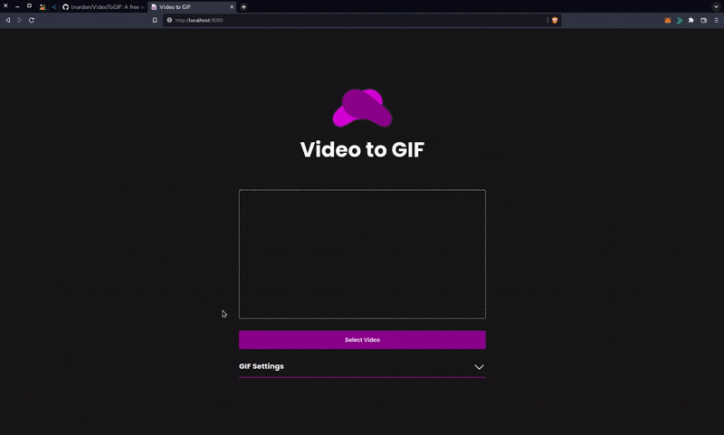

# [Video to GIF](https://nrd-video-to-gif.herokuapp.com/ "Homepage")

A free website to convert .mp4 files to .gif locally using ffmpeg (Web Assembly).

 

## [Try it here](https://nrd-video-to-gif.herokuapp.com/ "Homepage")

### What was used

- Reactjs
- Heroku
- ffmpeg (WebAssebly)
